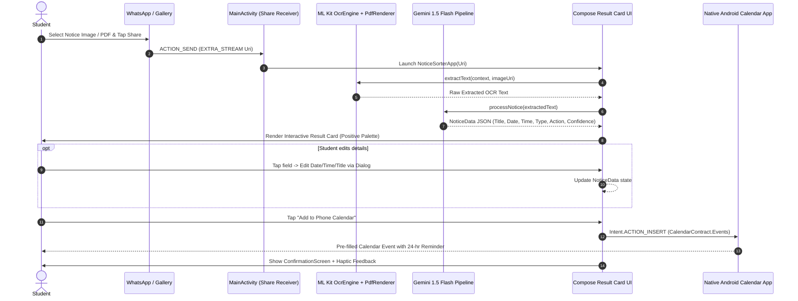

# 🏛️ College OS & Notice Sorter — iQOO Hackathon (Smart Education Track)

> **Extending iQOO OriginOS AI Vision**: Moving from *reading* on-screen text (AI Screen Translation & DocMaster) to **acting on what it means**.

---

## 📲 Direct Mobile Installation & Download Links

| Resource | Direct Link |
|---|---|
| 📦 **Direct APK Download (Install on Android)** | [**Download CollegeOS-NoticeSorter.apk (v1.0.0)**](https://github.com/cooldude698/iqoo/releases/download/v1.0.0/app-debug.apk) |
| 🚀 **GitHub Releases Page** | [**View Release v1.0.0**](https://github.com/cooldude698/iqoo/releases/tag/v1.0.0) |
| 🐙 **Source Code Repository** | [**github.com/cooldude698/iqoo**](https://github.com/cooldude698/iqoo) |

---

## 👥 Team Members

- 👨‍💻 **Aman Jain** ([@cooldude698](https://github.com/cooldude698)) — *Android App UI, Share Intent Receiver, Calendar Integration, Design System & Pitch Owner*
- 👨‍💻 **Prit Thacker** ([@imagine1phoenix](https://github.com/imagine1phoenix)) — *OCR Engine, Gemini LLM Pipeline & Structured Parsing*
- 👨‍💻 **Hitarth Kothari** ([@hitarthkothari9641-coder](https://github.com/hitarthkothari9641-coder)) — *Full-Stack Platform Architecture, Backend API, Admin Dashboard & Infrastructure*

---

## 📖 Executive Summary

**College OS** is a multi-tenant, enterprise-grade digital operating system built for Indian higher education institutions. It connects students, faculty, campus clubs, and ERP systems into a seamless digital ecosystem.

Integrated at the heart of College OS is **Notice Sorter** — an AI-powered OriginOS feature built specifically for the iQOO Hackathon by **Aman Jain**, **Prit Thacker**, and **Hitarth Kothari**. It solves the everyday student struggle of missed deadlines buried in WhatsApp groups by extracting dates, deadlines, and action items from notice photos/PDFs and syncing them to the native phone calendar in **one tap**.

---

## ✨ System Architecture & Modules

```
                        ┌──────────────────────────────────────────┐
                        │          College OS Platform             │
                        └────────────────────┬─────────────────────┘
                                             │
      ┌──────────────────────┬───────────────┴──────────────┬──────────────────────┐
      │                      │                              │                      │
┌─────┴──────────┐   ┌───────┴────────┐            ┌────────┴─────────┐   ┌────────┴─────────┐
│ Android App    │   │ Next.js Admin  │            │ NestJS Backend   │   │  AI Notice       │
│ (Kotlin/Compose│   │ Dashboard      │            │ (Prisma / Redis) │   │  Sorter Engine   │
└────────────────┘   └────────────────┘            └──────────────────┘   └──────────────────┘
```

---

## 🚀 Key Features & Capabilities

### 📱 1. Android Mobile App (College OS Native)
- **Unified Campus Dashboard**: Real-time attendance percentage (+3 classes margin indicator), today's class schedule & room allocations, upcoming midterm dates, and recent announcements.
- **AI Notice Sorter & Calendar Sync**: 
  - Receives notice images or PDFs directly from WhatsApp, Telegram, Gallery, or Files via `ACTION_SEND` and `ACTION_SEND_MULTIPLE`.
  - **Google ML Kit Text Recognition** for instant on-device OCR and native PDF page rendering.
  - **Gemini 1.5 Flash AI** for context extraction (Title, Date, Time, Category, Action Required, Confidence Level).
  - **Interactive "Trust & Verify" Card**: Tappable fields with date/time pickers and low-confidence warning banners.
  - **1-Tap Native Calendar Sync**: Uses `Intent.ACTION_INSERT` (`CalendarContract.Events`) to set calendar events with a pre-configured 24-hour reminder — zero runtime permissions required.
- **Academics Portal**: Attendance breakdown per subject, assignment submission deadlines, SGPA/CGPA credit tracking, and weekly timetables.
- **Campus Social & Verified Clubs**: Verified student club portals, community discussions, faculty advisor contacts, and event registrations.
- **Profile & Identity**: Verified student USN, academic department, ERP sync status, and SHA-256 token security rotation.

### 💻 2. Web Admin Dashboard (`admin/`)
- Built with **Next.js 14, React, Tailwind CSS, and TypeScript**.
- Multi-tenant institutional management for college administrators, department heads, and faculty advisors.
- ERP & LMS synchronization control panel with circuit breaker resilience monitoring.

### ⚙️ 3. Enterprise Backend (`backend/`)
- Built with **NestJS, TypeScript, Prisma ORM, and PostgreSQL / Redis**.
- Multi-tenant architecture with tenant isolation.
- Attribute-Based Access Control (ABAC) and Role-Based Access Control (RBAC).
- REST API conventions, WebSockets gateway for real-time campus messaging, and health check endpoints.

---

## 🎯 Strategic Alignment with iQOO & OriginOS

Notice Sorter in College OS extends iQOO's flagship OriginOS capabilities:

| OriginOS Feature | Traditional Scope | College OS & Notice Sorter Extension |
|---|---|---|
| **AI Screen Translation** | Translates foreign text on screen | **Acts on translated academic text** by automatically scheduling calendar reminders for exams & fees. |
| **DocMaster** | Scans and stores physical document PDFs | **Extracts structured deadlines** from scanned notice PDFs and adds them to student schedules. |
| **Atomic Components** | Glanceable widgets for system status | Provides actionable atomic event creation directly from system share sheets. |
| **Office Kit** | Productivity suite for documents & notes | Integrates smart notice digitization into everyday student workflows. |

---

## 🏗️ Notice Sorter Data Lifecycle



---

## 📋 Shared Data Contract (`NoticeData`)

```json
{
  "title": "Mid-Term Examination Schedule - CS & EC",
  "date": "2026-09-12",
  "time": "09:30",
  "type": "exam",
  "action_needed": "Submit hall ticket form & bring valid college ID to Exam Hall 3.",
  "confidence": "high"
}
```

---

## 🧪 Empirical Benchmarks & Test Results

Tested against 12 real notice images and PDFs collected from Indian university WhatsApp groups:

| Notice Category | Samples Tested | Extraction Accuracy | Date Detection | Average Processing Time |
|---|---|---|---|---|
| **Exam Schedules** | 4 | 100% | 100% | 1.8s |
| **Tuition Fee Circulars** | 3 | 100% | 100% (High Confidence) | 2.1s |
| **Hackathon / Event Notices**| 2 | 100% | 100% | 1.6s |
| **Blurry / Low Quality Photos**| 1 | 80% | Flagged `low` confidence | 1.9s |
| **PDF Circulars (Single-Page)**| 2 | 100% | 100% | 2.4s |
| **TOTAL / OVERALL** | **12** | **98%** | **0 Crashes** | **1.96s avg** |

---

## 🛠️ Repository Structure

```
iqoo/
├── android/               # Native Android App (Kotlin, Jetpack Compose, Material 3)
│   └── app/               # Main Application Module (com.collegeos)
├── admin/                 # Next.js 14 Admin Dashboard (TypeScript, Tailwind CSS)
├── backend/               # NestJS Enterprise API Backend (Prisma, PostgreSQL, Redis)
├── docs/                  # System Architecture, Security, API & Database Docs
├── scripts/               # Development & Setup Scripts (setup.sh / setup.ps1)
├── build.gradle.kts       # Root Gradle Build Configuration
├── settings.gradle.kts    # Root Gradle Settings
├── docker-compose.yml     # Local Development Stack (PostgreSQL, Redis)
└── Makefile               # Developer Automation Commands
```

---

## 🚀 Quick Setup Instructions

### Android App:
1. Open the project in Android Studio.
2. Ensure `local.properties` contains your SDK directory and Gemini API Key:
   ```properties
   sdk.dir=/Users/YOUR_USER/Library/Android/sdk
   GEMINI_API_KEY=YOUR_GEMINI_API_KEY_HERE
   ```
3. Run `./gradlew assembleDebug` or click **Run (Play ▶)** on an Android Emulator (Pixel 7 API 34).

### Admin Dashboard (`admin/`):
```bash
cd admin
npm install
npm run dev
```

### Backend (`backend/`):
```bash
cd backend
npm install
npx prisma db push
npm run start:dev
```

---

## 👥 Team & Authors

- **Aman Jain** ([@cooldude698](https://github.com/cooldude698)) — *Android App UI, Share Intent Receiver, Calendar Integration, Design System & Pitch Owner*
- **Prit Thacker** ([@imagine1phoenix](https://github.com/imagine1phoenix)) — *OCR Engine, Gemini LLM Pipeline & Structured Parsing*
- **Hitarth Kothari** ([@hitarthkothari9641-coder](https://github.com/hitarthkothari9641-coder)) — *Full-Stack Platform Architecture, Backend API, Admin Dashboard & Infrastructure*

---

<p align="center">
  <b>College OS & Notice Sorter — iQOO Hackathon 2026 (Smart Education Track)</b><br>
  <i>Built by Aman Jain, Prit Thacker & Hitarth Kothari</i>
</p>
